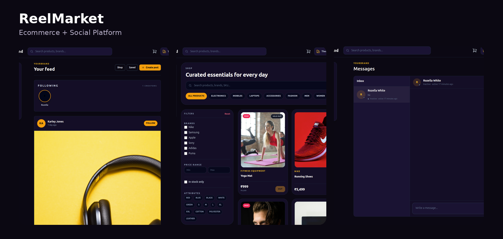

ReelMarket

  

  <strong>Ecommerce + Social Platform built with Laravel</strong>

About ReelMarket

ReelMarket is a Laravel-based ecommerce and social platform that combines online shopping with social networking features.

The platform provides ecommerce functionality such as products, categories, brands, shopping cart, checkout, orders, and payment status management, along with social features such as profiles, posts, follows, likes, comments, notifications, reels, and messaging.

Features

🛒 Ecommerce

Product listing and search

Product categories

Brands

Product attributes

Product variants

Shopping cart

Checkout

Coupon / discount support

Orders

Order status management

Payment status management

Product-related functionality

👥 Social Network

User profiles

Follow / Unfollow

Follow Back

Posts

Likes

Comments

Notifications

Suggested users

Reels

Social activity

💬 Messaging

Direct conversations

User-to-user messaging

Conversation management

Real-time messaging

Active / online status

🔔 Notifications

Follow notifications

Follow Back notifications

Social activity notifications

Notification read / unread state

🛠️ Admin Panel

User management

Roles and permissions

Categories

Brands

Attributes

Products

Orders

Reports

Social network management

Tech Stack

Technology

Usage

Laravel

Backend framework

PHP

Server-side language

MySQL

Database

Livewire

Reactive UI

Filament

Admin panel

Laravel Reverb

Real-time broadcasting

Laravel Echo

Real-time frontend communication

Tailwind CSS

UI styling

JavaScript

Frontend functionality

Project Structure

ReelMarket/
├── app/
│   ├── Filament/
│   ├── Livewire/
│   ├── Models/
│   └── Services/
├── database/
│   ├── migrations/
│   └── seeders/
├── public/
│   └── images/
├── resources/
│   ├── css/
│   ├── js/
│   └── views/
├── routes/
└── README.md

Installation

1. Clone the repository

git clone https://github.com/mustaak/ReelMarket.git
cd ReelMarket

2. Install PHP dependencies

composer install

3. Install frontend dependencies

npm install

4. Create environment file

cp .env.example .env

5. Generate application key

php artisan key:generate

6. Configure database

Update the database credentials in your .env file.

Example:

DB_CONNECTION=mysql
DB_HOST=127.0.0.1
DB_PORT=3306
DB_DATABASE=your_database
DB_USERNAME=your_username
DB_PASSWORD=your_password

7. Run migrations

php artisan migrate

If your project requires seed data:

php artisan db:seed

8. Create storage link

php artisan storage:link

9. Start Laravel development server

php artisan serve

10. Start frontend development server

npm run dev

Development

For local development, run Laravel and the frontend development server separately:

php artisan serve

npm run dev

If using Laravel Reverb for real-time functionality, start the Reverb server according to your local environment configuration.

Testing

Run the Laravel test suite with:

php artisan test

Git Workflow

Create or switch to the development branch:

git switch development

Pull the latest changes:

git pull origin development

After making changes:

git add -A
git commit -m "Update project"
git push origin development

To merge development changes into main:

git switch main
git pull origin main
git merge development
git push origin main

Repository

GitHub:
https://github.com/mustaak/ReelMarket

License

This project is currently maintained as a private development project.